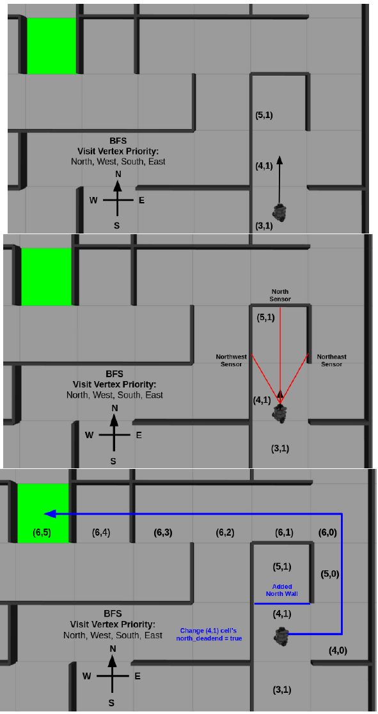

# Turtlebot3-Path-Planning

C++ implementation of Breath-First_Search (BFS) algorithm and PID Control to navigate a TurtleBot3 through a Maze in ROS.

**Maze Objective (Goal highlighted in Green)**

**Optimization of BFS**

Visit Vertex Priority: North, West, South, East. Optimized Path planning algorithm by checking dead ends in adjacent north cells.

Optimized BFS Shortest Path to Goal

**BFS in Action**

